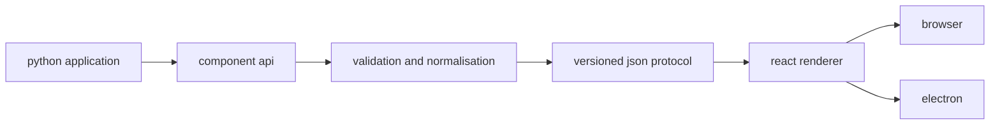

# architecture

```mermaid
flowchart LR
  A[python application] --> B[component api]
  B --> C[validation and normalisation]
  C --> D[versioned json protocol]
  D --> E[react renderer]
  E --> F[browser]
  E --> G[electron]
```

python handles logic. react handles rendering. communication uses a versioned json protocol over websocket.
